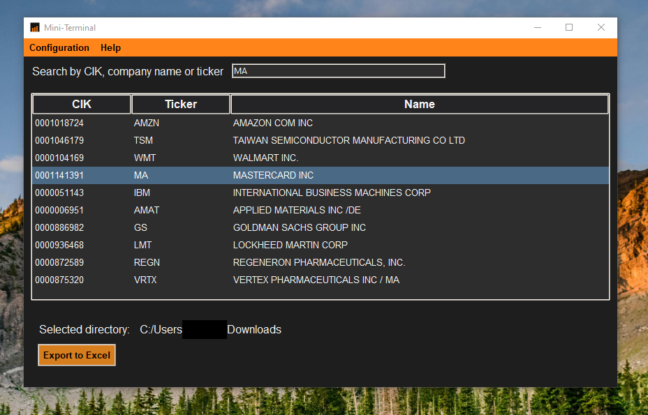
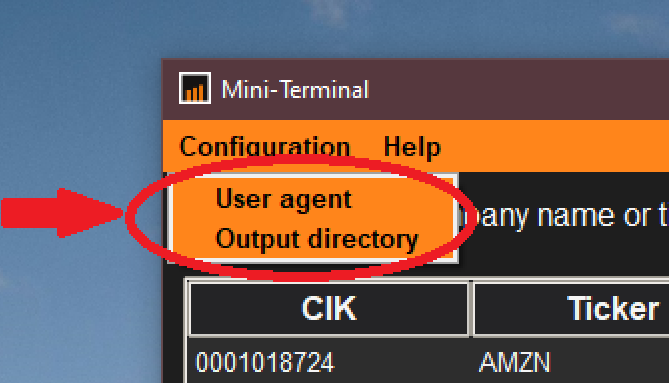

# Mini-Terminal
## 📄Overview
This program provides a graphical user interface (GUI) for searching and extracting financial data from the U.S. Securities and Exchange Commission (SEC) EDGAR database. Users can filter companies by CIK, company name, or ticker, and export financial data directly to an Excel file. The data retrieved covers filings from the second quarter of 2009 to the most recent report.

<p align="center">
  
</p>

## 🛠️Installation
### Manual instalation
  - Ensure you have Python 3.10.5 or latest versions installed.
```bash
python --version
```
  - Create a virtualenv.
```bash
python -m venv venv_name #ex: python -m venv env
```
  - Activate the Virtual Environment
```bash
#On Windows
venv_name\Scripts\activate
```
```bash
#On macOS/Linux
source venv_name/bin/activate
```
  - Install the required libraries
```bash
pip install -r requirements.txt
```
  - Run the main script -> main_menu.py

### Using the Windows installer
[Click to download](https://github.com/samuellleo/Mini-Terminal/raw/main/Mini-Terminal%20-%20Installer.exe?download=)

## ⚙️Configuration
  - User-Agent Configuration:
On the first launch, you'll be prompted to input a "User-Agent". This is necessary to interact with the EDGAR API. You can change this configuration later via the "Configuration" menu under "User-Agent".
  - Output Directory:
The program allows you to specify the directory where the Excel files will be saved. You can set or change this directory in the "Output Directory" menu under "Configuration".

<p align="center">
  
</p>

## 🖥️User Interface
  - Search Bar: Enter a CIK, company name, or ticker to search for companies.
  - Company List: Once you perform a search, the companies matching your criteria will appear in the list. You can select one to export its financial data.
  - Export Button: After selecting a company, click "Export to Excel" to generate an Excel file with all available financial data.

## 🛑Known Issues and Limitations
  - The "User-Agent" must be valid to retrieve data; invalid user-agents will cause connection errors. A valid user-agent can be "example@gmail.com" or "<<company name>> name.surname@<<company name>>.com"
  - Data retrieval can take some time depending on the size of the company's filings.

## 🔗US Securities and Exchange Commision API docummentation

<p align="center">
  <a href="https://www.sec.gov">
    
  </a>
</p>

[Documentation page](https://www.sec.gov/search-filings/edgar-application-programming-interfaces)
### ⚠️API Usage Disclaimer⚠️
This program utilizes a public API provided by the U.S. Securities and Exchange Commission (SEC). It is important to use the API responsibly to avoid potential traffic restrictions or blocking.

The SEC recommends limiting the number of requests to no more than 10 per second. Exceeding this rate may result in your traffic being blocked by the SEC. For more detailed guidelines and information, please refer to the official SEC page [here](https://www.sec.gov/about/webmaster-frequently-asked-questions#developers).

## 📜License
This software is distributed under Apache License 2.0.
